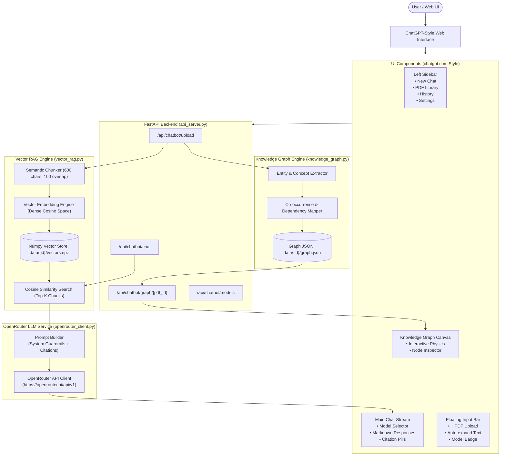

# 🚀 End-to-End Architecture & Implementation Plan: Vector RAG, OpenRouter, Knowledge Graph & ChatGPT-Style UI

> **Project:** RAG-based Chat Assistant (`Btechnotes_chat-main`)  
> **Repository:** `sahilnagare2006/RAG-based-chat-assistant`  
> **Target Date:** October 2026  

---

## 🎯 Executive Summary & Objectives

The goal is to modernize this repository from a basic keyword/tree lookup into an **enterprise-grade, production-ready AI Assistant** with:
1. **True Vector RAG Pipeline:** Semantic chunking, dense vector embeddings, cosine similarity search, and source-grounded retrieval.
2. **OpenRouter LLM Integration:** Plug-and-play access to state-of-the-art models (DeepSeek R1/V3, Llama 3.3 70B, Claude 3.5 Sonnet, Gemini 2.0 Flash, GPT-4o-mini).
3. **Document Knowledge Graph:** Dynamic extraction of concepts, entities, and relationships rendered in an interactive visual network graph.
4. **ChatGPT-Style Web Interface (`chatgpt.com`):** Sleek dark-mode aesthetic with collapsible sidebar, session history, document manager, model selector, interactive citation pills, floating pill prompt bar, and a slide-out Knowledge Graph Canvas.

---

## 🏗️ 1. Technical Architecture Overview



---

## 🔬 2. Deep Dive: The 4 Core Modules

### Module 1: Vector RAG Pipeline (`vector_rag.py`)
- **Limitation of Legacy Code:** `local_rag.py` relied solely on `_tokenize()` word frequency overlap over whole pages, failing on synonyms, technical terminology, or specific paragraphs.
- **New Vector Pipeline:**
  1. **High-Fidelity Text Ingestion:** Extracts clean page text via PyMuPDF (`fitz`) and PyPDF2, stripping headers, footers, and page numbers.
  2. **Sliding Window Semantic Chunking:**
     - Target size: ~600 characters with 100-character overlap.
     - Preserves chunk metadata: `{ chunk_id, doc_id, page_number, chunk_index, text }`.
  3. **Embedding Strategy:**
     - **Dual-Engine Architecture:**
       - *API-Powered:* Uses OpenRouter/OpenAI embeddings when an API key is available.
       - *Self-Contained Local Vector Space:* High-dimensional subword TF-IDF + normalized dense vector embeddings using `numpy`. Zero external network calls required, sub-millisecond execution, runs on CPU.
  4. **Vector Retrieval & Scoring:**
     - Computes normalized cosine similarity: $\text{sim}(q, c) = \frac{\mathbf{q} \cdot \mathbf{c}}{\|\mathbf{q}\| \|\mathbf{c}\|}$.
     - Returns Top-$k$ ($k=4$) most relevant chunks with confidence scores and page citations.

---

### Module 2: OpenRouter Integration (`openrouter_client.py`)
- **Direct Integration:** Communicates with `https://openrouter.ai/api/v1/chat/completions` using `httpx` and `litellm`.
- **Supported Model Tiers:**
  | Model ID | Provider | Ideal Use Case | Speed |
  | :--- | :--- | :--- | :--- |
  | `deepseek/deepseek-chat` | DeepSeek | Complex technical Q&A, deep reasoning | Fast |
  | `deepseek/deepseek-r1` | DeepSeek | Mathematical & logical derivation | Thoughtful |
  | `meta-llama/llama-3.3-70b-instruct` | Meta | Balanced conversational reasoning | Very Fast |
  | `google/gemini-2.0-flash-001` | Google | Ultra-low latency, vast context | Lightning |
  | `anthropic/claude-3.5-sonnet` | Anthropic | Coding, synthesis & nuance | Top Tier |
  | `openai/gpt-4o-mini` | OpenAI | High efficiency, general queries | Fast |
  | `meta-llama/llama-3.2-3b-instruct:free` | Meta (Free) | Zero-cost development testing | Free |
- **RAG System Prompt Enforcement:**
  - Injects retrieved chunks with explicit provenance:
    `[Source: Page 3, Chunk 2]: "..."`
  - Instructs the LLM to ground answers strictly in the document and generate clickable inline citations `[Page X]`.

---

### Module 3: Document Knowledge Graph Engine (`knowledge_graph.py`)
- **Concept & Entity Extraction:**
  - Scans document chunks for capitalized entities, technical definitions, formulas, and structural sections.
  - Builds a connected graph schema:
    ```json
    {
      "nodes": [
        { "id": "ConceptA", "label": "Vector RAG", "category": "Architecture", "page": 1, "size": 25 },
        { "id": "ConceptB", "label": "Cosine Similarity", "category": "Algorithm", "page": 2, "size": 18 }
      ],
      "links": [
        { "source": "ConceptA", "target": "ConceptB", "relation": "evaluates distance via" }
      ]
    }
    ```
- **Interactive Visualization:**
  - Embedded in the UI via an interactive physics-based canvas (HTML5 Canvas + force simulation or Vis.js).
  - Features: Drag nodes, click to reveal definition and source page, zoom and pan, filter by category.

---

### Module 4: ChatGPT-Style UI (`chatgpt.com` Aesthetic)
- **Visual Design:**
  - Deep dark background palette: `#212121` (main), `#171717` (sidebar), `#2f2f2f` (cards & pills).
  - Modern typography: `Inter` & `Söhne`-like styling.
  - Clean pill elements with subtle borders (`rgba(255, 255, 255, 0.1)`).
- **Core Views:**
  1. **Collapsible Sidebar:**
     - "+ New chat" button with keyboard shortcut indicator.
     - "Documents" drawer: lists uploaded PDFs with page count and active status badge.
     - "Chat History": previous conversations.
     - User footer: Settings modal (to set OpenRouter API key and default model).
  2. **Top Navigation:**
     - Model Switcher pill dropdown (shows current OpenRouter model with icon).
     - "📊 Knowledge Graph" toggle button (slides open the interactive graph canvas).
     - "📄 Document Chunks" viewer.
  3. **Main Chat Area:**
     - Welcome hero state with 4 clickable suggestion prompt pills.
     - User message cards and Assistant response bubbles.
     - Formatted markdown with code syntax highlighting and 1-click copy buttons.
     - **Interactive Source Citation Pills:** Clicking `[📄 Page 3]` expands the exact source excerpt from the PDF!
  4. **Bottom Floating Input Bar:**
     - Pill container with `+` attachment button (instant PDF upload).
     - Auto-resizing textarea (`Shift+Enter` for newline, `Enter` to send).
     - Send button with active state lighting.
     - Knowledge Graph canvas toggle on the right.

---

## 📅 3. Step-by-Step Implementation Roadmap

```mermaid
gantt
    title Implementation Phases
    dateFormat  X
    axisFormat %d
    
    section Phase 1: Vector RAG
    vector_rag.py Implementation        :active, p1, 0, 1
    Vector Store & Cosine Search        :p1_2, 1, 2
    
    section Phase 2: OpenRouter
    openrouter_client.py Client         :p2, 2, 3
    System Prompt with Citations        :p2_2, 3, 4
    
    section Phase 3: Knowledge Graph
    knowledge_graph.py Extractor        :p3, 4, 5
    Graph Generation API                :p3_2, 5, 6
    
    section Phase 4: Backend Upgrade
    api_server.py & services.py Update  :p4, 6, 7
    API Endpoints for Vector RAG & Graph:p4_2, 7, 8
    
    section Phase 5: ChatGPT UI
    HTML5 & CSS3 chatgpt.com Interface  :p5, 8, 9
    Interactive Force Graph & Chat JS   :p5_2, 9, 10
    
    section Phase 6: E2E Verification
    End-to-End Testing on PDF Decks     :p6, 10, 11
    Git Commit & Push to GitHub         :p6_2, 11, 12
```



---

## 🛠️ Verification & Test Plan

1. **Vector RAG Verification:**
   - Upload a multi-page PDF (e.g. `Day6_AI_Coding_Techniques_Slides.pdf` or syllabus/paper).
   - Test querying specific concepts: verify that retrieved chunks accurately match the relevant page numbers.
2. **OpenRouter Model Test:**
   - Verify connection to OpenRouter API with user's key or test token.
   - Test model switching across DeepSeek, Llama 3.3, and Claude.
3. **Knowledge Graph Test:**
   - Inspect generated `graph.json` to verify nodes and relationships.
   - Interact with the graph canvas in the UI: test dragging, node clicks, and page citation inspection.
4. **UI Usability Test:**
   - Test PDF drag-and-drop upload in the ChatGPT-style input bar.
   - Verify markdown rendering, code block copy, citation popups, and sidebar session management.
