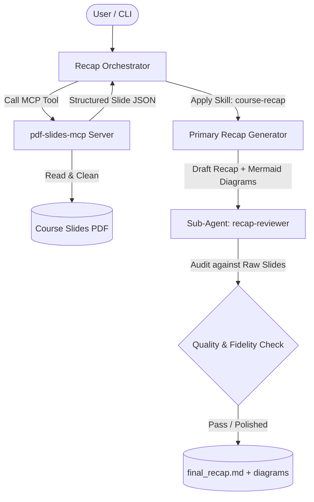

# Course Recap Generator — Architecture & Planning Phase

> **Assignment:** Day 6 Assignment — Course Recap Generator  
> **Course:** AI Coding Techniques (deboistech)  
> **Harness:** OpenCode CLI (v2.0.20)  
> **Date:** October 2026  

---

## 1. Objectives & Requirements Analysis

The objective is to build a focused, reusable, and token-efficient tool that takes PDF slides from the course and generates:
1. An automated, high-fidelity structured summary.
2. Conceptual and architectural diagrams in Mermaid.js visual format.
3. Quality verification through an agentic workflow.

### Core Constraints & Tenets
- **Agent Harness:** OpenCode CLI.
- **Single Clean Pass:** No unbounded looping or runaway token consumption. Pipeline: `Input PDF -> MCP Slide Extraction -> Synthesis -> Sub-Agent Review -> Final Markdown & Diagrams`.
- **Modularity:** Reusable custom skill and standalone Model Context Protocol (MCP) server.

---

## 2. Key Architectural Decisions

### Decision 1: How will the tool read and extract content from PDF(s)?
- **Option A (Naive):** Paste raw text into prompt or dump binary file into context.
  - *Drawbacks:* Consumes thousands of unnecessary tokens, gets cluttered with header/footer watermarks, lacks slide boundaries.
- **Option B (Selected — MCP Server):** Dedicated MCP server (`pdf-slides-mcp`) providing stdio JSON-RPC tools:
  - `extract_pdf_slides`: Extracts slide-by-slide structure (`slide_index`, `title`, `bullets`, `clean_text`, `char_count`).
  - `get_slide_metadata`: Returns deck page count, title, table of contents/outline.
  - `validate_mermaid`: Validates syntax of generated Mermaid diagrams.
  - *Benefits:* The agent harness offloads heavy extraction to a specialized tool, getting clean, normalized structured JSON.

### Decision 2: What should the summary structure look like?
- **Option A (Per-slide dump):** Chronological slide-by-slide notes.
  - *Verdict:* Too fragmented. Good slides often split a single concept across 4–5 slides.
- **Option B (Whole-deck high-level abstract):** One short 3-paragraph summary.
  - *Verdict:* Misses technical specifics, commands, and code patterns.
- **Option C (Selected — Topic-Synthesized with Slide Lineage):**
  - **Executive Summary:** The 2-minute pitch of the session.
  - **Concept Architecture Matrix:** Table mapping key concepts, descriptions, and source slide numbers.
  - **Module Deep Dives:** Synthesis of each core topic with technical details and code snippets.
  - **Tool & Command Reference:** Specific CLI flags, configs, and commands taught in the deck.
  - **Key Takeaways & Action Items:** What the student must be able to do or remember.

### Decision 3: What kind of diagram fits this content?
- **Selected Formats in Mermaid.js:**
  1. **Topic Hierarchy / Concept Mindmap:** Visualizes relationship between core topics, sub-themes, and components.
  2. **Workflow Flowchart (`flowchart TD` or `sequenceDiagram`):** Visualizes the execution lifecycle (e.g. agent orchestration, MCP tool invocation, review pass).
- *Why Mermaid?* Zero-dependency native markdown rendering across GitHub, OpenCode preview, Obsidian, and standard markdown viewers.

---

## 3. Component Architecture

---

## 4. Sub-Agent Specification: `recap-reviewer`
- **Role:** Independent Quality & Fidelity Auditor.
- **Mandate:**
  1. Cross-reference generated draft against original slide content.
  2. Detect missing technical concepts or terminology drift.
  3. Validate Mermaid syntax to prevent rendering failures.
  4. Ensure conciseness and remove fluff.

---

## 5. Custom Skill Specification: `course-recap`
- **Location:** `.opencode/skills/course-recap/SKILL.md`
- **Capabilities:**
  - Standardizes the 5-part recap template.
  - Enforces Mermaid diagram styling best practices (clean node labels, no syntax breaking symbols, valid orientation).
  - Outlines concept extraction heuristics for lecture slides.

---

## 6. Execution Plan
1. Implement the local MCP Server (`mcp_server/pdf_slides_mcp.py`) supporting stdio JSON-RPC.
2. Register the MCP server and custom sub-agent in `opencode.json`.
3. Create the custom skill `.opencode/skills/course-recap/SKILL.md`.
4. Create the sub-agent prompt `.opencode/agents/recap-reviewer.md`.
5. Create an automated runner `recap.py` to run the single clean pass end-to-end.
6. Test on real slides and save output artifacts.
7. Complete comprehensive documentation in `README.md`.
