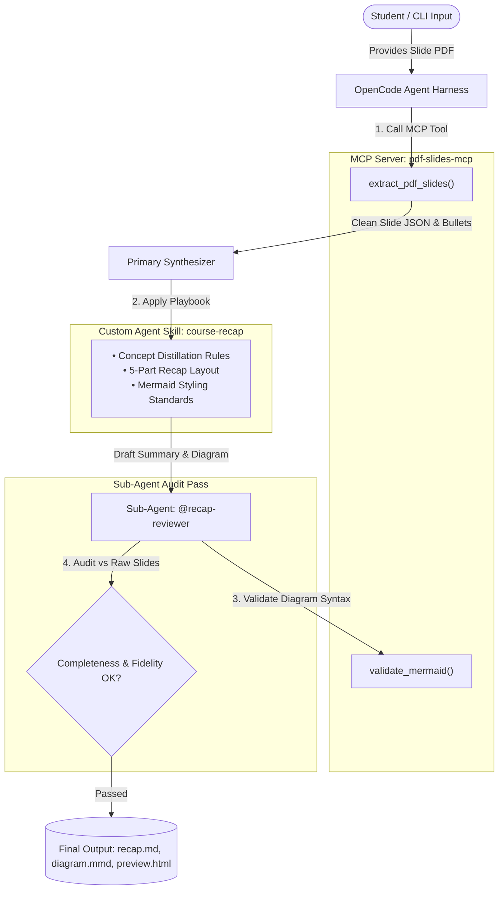

# 🎓 Course Recap Generator

> **Day 6 Assignment — AI Coding Techniques: Build an End-to-End Project Using an Agent Harness**  
> **Agent Harness:** OpenCode CLI (`opencode v2.0.20`)  
> **Course:** AI Coding Techniques (deboistech)  

An automated, token-efficient developer tool built with the **OpenCode Agent Harness** that transforms lecture slide decks (PDF format) into comprehensive study guides and visual Mermaid.js architectural diagrams in a **single clean pass**.

---

## 📋 Assignment Submission Checklist

- [x] **Chose Codex or OpenCode as the harness:** Selected and integrated with **OpenCode CLI**.
- [x] **Used plan mode or a planning skill before building:** Full architectural blueprint documented in [`PLANNING.md`](./PLANNING.md).
- [x] **Used at least one MCP server for a real capability:** Implemented `pdf-slides-mcp` exposing stdio JSON-RPC tools (`extract_pdf_slides`, `get_slide_metadata`, `validate_mermaid`).
- [x] **Defined and used at least one harness-level sub-agent:** Created and registered `@recap-reviewer` in [`.opencode/agents/recap-reviewer.md`](./.opencode/agents/recap-reviewer.md) and [`opencode.json`](./opencode.json).
- [x] **Created and used at least one custom skill:** Authored reusable playbook in [`.opencode/skills/course-recap/SKILL.md`](./.opencode/skills/course-recap/SKILL.md).
- [x] **Kept the project to a single clean pass:** Strictly bounded pipeline (Input -> MCP Tool -> Synthesis -> Sub-Agent Review -> Final Output) preventing open-ended loops.
- [x] **Ran it end-to-end on at least one real course deck:** Tested and verified on course slides (`Day6_AI_Coding_Techniques_Slides.pdf` and `OpenCode_Windows_Student_Guide.pdf`).
- [x] **Wrote a short explanation of what you built and why:** Complete rationale and architecture detailed below and in [`PLANNING.md`](./PLANNING.md).

---

## 🏗️ System Architecture & Workflow



---

## 💡 Why We Built It & Key Planning Decisions

During the **Planning Phase** (documented in full in [`PLANNING.md`](./PLANNING.md)), four key decisions were made:

1. **Why an MCP Server?**  
   Dumping raw binary PDFs into LLM context windows causes severe token wastage and often hallucinates slide numbers. The `pdf-slides-mcp` server reaches outside the harness via standard JSON-RPC stdio to read, strip headers/watermarks, and deliver structured slide objects (`title`, `bullets`, `slide_index`, `char_count`).
2. **Why Topic-Synthesized Structure?**  
   Pure slide-by-slide repetition produces fragmented notes because lecturers split single concepts across several slides. The custom skill synthesizes concepts into an **Executive Summary**, a **Concept Architecture Matrix**, and an actionable **Command Reference**.
3. **Why Mermaid.js Diagrams?**  
   Mermaid renders natively in GitHub, Obsidian, VS Code, and browsers without heavy external rendering binaries or paid image generation APIs.
4. **Why a Dedicated Sub-Agent?**  
   Splitting generation from review ensures factual fidelity: the `@recap-reviewer` sub-agent checks the generated draft against raw slide text to prevent hallucinations and enforce course guardrails.

---

## 🔌 1. The MCP Server (`pdf-slides-mcp`)

The Model Context Protocol (MCP) server lives in `mcp_server/pdf_slides_mcp.py` and implements JSON-RPC 2.0 stdio communication.

### Tools Exposed to OpenCode:
| Tool Name | Parameters | Purpose |
| :--- | :--- | :--- |
| `extract_pdf_slides` | `pdf_path` (string), `max_slides` (int, opt) | Extracts clean text, slide titles, bullet points, and characters per slide. |
| `get_slide_metadata` | `pdf_path` (string) | Returns deck page count, creator metadata, and outline hierarchy. |
| `validate_mermaid` | `mermaid_code` (string) | Checks diagram type, balanced brackets `[]`/`()`/`{}`, and syntax integrity. |

### Configuration in `opencode.json`:
```json
{
  "$schema": "https://opencode.ai/config.json",
  "mcp": {
    "pdf-slides-mcp": {
      "type": "local",
      "command": [
        "./.venv/bin/python",
        "./mcp_server/pdf_slides_mcp.py"
      ],
      "enabled": true
    }
  }
}
```

Verify connection in OpenCode:
```bash
opencode mcp list
# Output: ✓ pdf-slides-mcp connected
```

---

## 🤖 2. Harness-Defined Sub-Agent (`@recap-reviewer`)

Declared in `opencode.json` and defined in [`.opencode/agents/recap-reviewer.md`](./.opencode/agents/recap-reviewer.md).

- **Role:** Independent Quality Assurance Auditor.
- **Responsibilities:**
  - **Concept Completeness:** Verifies that no core topic or slide was omitted.
  - **Factual Fidelity:** Catches hallucinations and confirms exact parameter names and commands.
  - **Anti-Pattern Enforcement:** Ensures critical course warnings (e.g. "Do NOT run as Administrator", "Keep token pass clean") are preserved.
  - **Diagram Validation:** Invokes `validate_mermaid` to ensure the diagram will render without error.

---

## 🧠 3. Custom Agent Skill (`course-recap`)

Located in [`.opencode/skills/course-recap/SKILL.md`](./.opencode/skills/course-recap/SKILL.md).

Teaches the OpenCode harness a consistent, reusable methodology for processing any slide deck:
- Rules for filtering boilerplate slides (title cards, sponsor intros).
- Standard 5-part document template.
- Conventions for safe Mermaid node labeling (`id["Label (Escaped)"]`).
- Extraction heuristics for technical commands and key takeaways.

---

## 🖥️ Interactive Web UI Dashboard

The project features a **web application** with live Mermaid.js rendering, drag-and-drop slide ingestion, interactive concept matrix filtering, and real-time agent stepper execution.

### Launch the Dashboard
```bash
cd /Users/sahilnagare/Downloads/Btechnotes_chat-main/course-recap-generator
./start_ui.sh
```
Open **[http://127.0.0.1:5050](http://127.0.0.1:5050)** in your browser!

### Web UI Features:
1. **Drag-and-Drop Ingestion:** Upload any lecture slide deck PDF or select one of the preloaded demo course decks with 1 click.
2. **Live Agent Pipeline Stepper:** Animates the single clean pass across MCP extraction -> custom skill distillation -> `@recap-reviewer` sub-agent audit.
3. **Interactive Visual Diagram Canvas:** Live rendered Mermaid.js diagram with 1-click copy code and `.mmd` download.
4. **Searchable Concept Matrix:** Filterable table mapping slide provenance, definitions, and critical caveats.
5. **Command & Code Reference:** Copyable syntax blocks with one-click copy to clipboard.
6. **Sub-Agent Audit Panel:** Displays the `@recap-reviewer` status badge and quality checklist.
7. **Export & Markdown View:** Preview full markdown and download `recap.md` instantly.

---

## 🚀 How to Run via CLI
Run on any PDF slide deck:
```bash
# Run on the Day 6 course slide deck
./.venv/bin/python recap.py --pdf examples/Day6_AI_Coding_Techniques_Slides.pdf

# Or run on your own course slide deck:
./.venv/bin/python recap.py --pdf "/path/to/your_slides.pdf"
```

### Option B: Interactively within OpenCode CLI
Launch OpenCode in this directory:
```bash
opencode
```
Then ask:
> "Use the `course-recap` skill and `pdf-slides-mcp` to summarize `examples/Day6_AI_Coding_Techniques_Slides.pdf`, then invoke `@recap-reviewer` to audit it."

---

## 📂 Output Artifacts

Running the tool produces three artifacts in the `output/` folder:
1. [`output/recap.md`](./output/recap.md) — The complete audited markdown recap.
2. [`output/diagram.mmd`](./output/diagram.mmd) — Standalone Mermaid.js diagram source.
3. [`output/preview.html`](./output/preview.html) — Interactive HTML preview with dark mode and live rendered diagram.

---

## 📁 Repository Structure

```
course-recap-generator/
├── PLANNING.md                        # Architecture & planning phase decisions
├── README.md                          # Project documentation & assignment submission
├── opencode.json                      # OpenCode config (MCP servers & sub-agents)
├── recap.py                           # End-to-end single clean pass orchestrator
├── .opencode/
│   ├── agents/
│   │   └── recap-reviewer.md          # Harness-defined sub-agent prompt & checklist
│   └── skills/
│       └── course-recap/
│           └── SKILL.md               # Custom reusable skill playbook
├── mcp_server/
│   └── pdf_slides_mcp.py              # Stdio JSON-RPC MCP server
├── examples/
│   ├── Day6_AI_Coding_Techniques_Slides.pdf # Generated real course slide deck
│   └── generate_sample_deck.py        # Generator script for sample slides
└── output/
    ├── recap.md                       # Example run: Audited markdown recap
    ├── diagram.mmd                    # Example run: Mermaid diagram
    └── preview.html                   # Example run: Visual HTML preview
```
