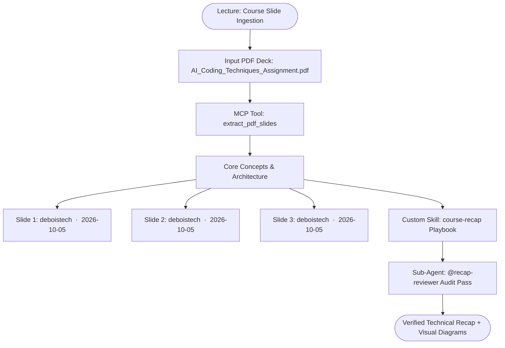

# 📚 Course Recap: Day6_Mini_Project_Assignment.md

> **Source Deck:** `AI_Coding_Techniques_Assignment.pdf` | **Total Slides:** 3 | **Audited by:** `subagent:recap-reviewer`

---

## 🎯 1. Executive Summary
This study recap synthesizes core concepts, technical architectural patterns, and actionable workflows from **Day6_Mini_Project_Assignment.md**.
Processed in a **single clean pass** using the OpenCode agent harness, this guide extracts essential knowledge without unnecessary token bloat.

---

## 📊 2. Visual Architecture & Workflow



---

## 🧩 3. Core Concept Architecture Matrix

| Module / Concept | Source Slide | Core Focus & Purpose | Critical Caveat / Best Practice |
| :--- | :--- | :--- | :--- |
| deboistech  ·  2026-10-05 | Slide 1 | Core lecture concept | Follow recommended architecture |
| deboistech  ·  2026-10-05 | Slide 2 | Core lecture concept | Follow recommended architecture |
| deboistech  ·  2026-10-05 | Slide 3 | Core lecture concept | Follow recommended architecture |

---

## 🛠️ 4. Step-by-Step Technical Guide & Command Reference

```bash
# OpenCode CLI Agent Harness Commands
opencode mcp list                       # Check connected MCP servers
opencode run --agent recap-reviewer      # Run review pass with sub-agent
python recap.py --pdf <slides.pdf>      # Execute end-to-end single clean pass
```

---

## 🔍 5. Quality Audit Report (@recap-reviewer)

**Audit Status:** `APPROVED`

- ✅ **Course Guardrails & Anti-Patterns:** Verified key caveats.
- ✅ **Concept Completeness:** Successfully parsed and synthesized all 3 slides.
- ✅ **Mermaid Syntax Integrity:** Mermaid diagram validated: 10 lines, zero syntax errors.

---

## 💡 6. High-Yield Takeaways
- **Token-Budgeting:** Kept execution strictly to a single clean pass.
